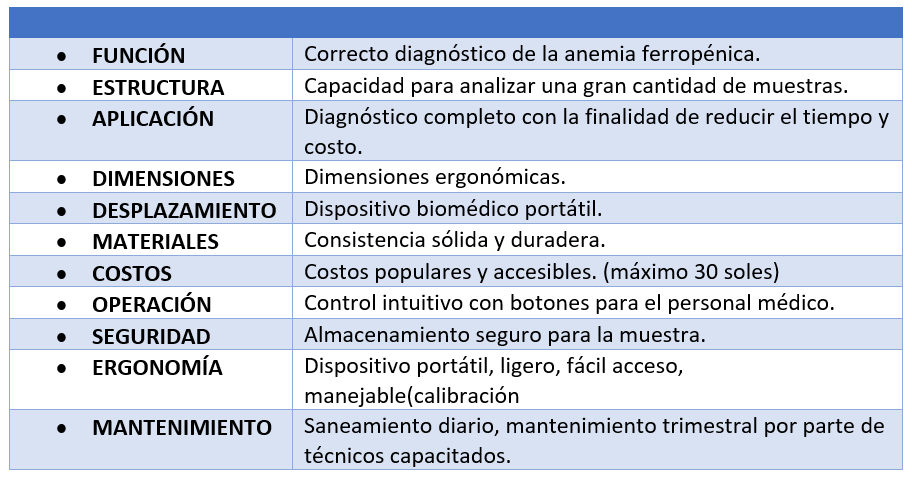
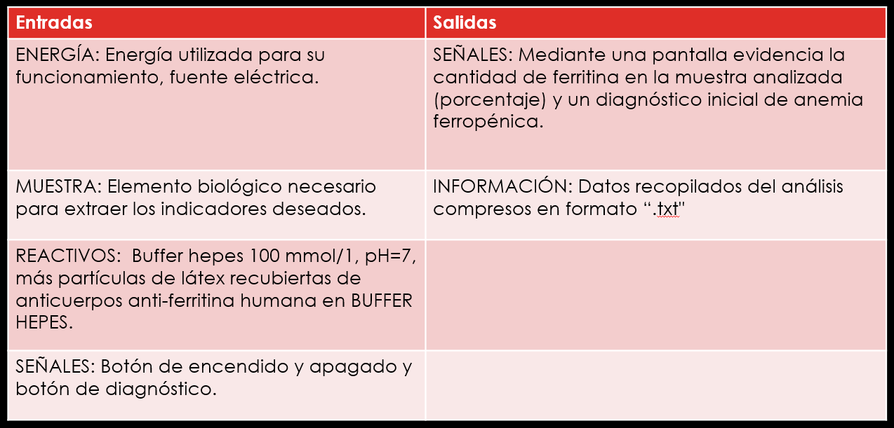
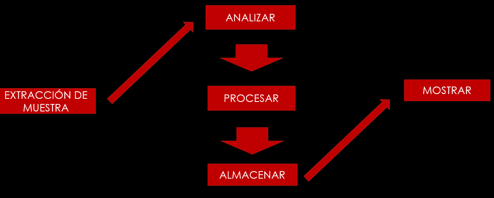
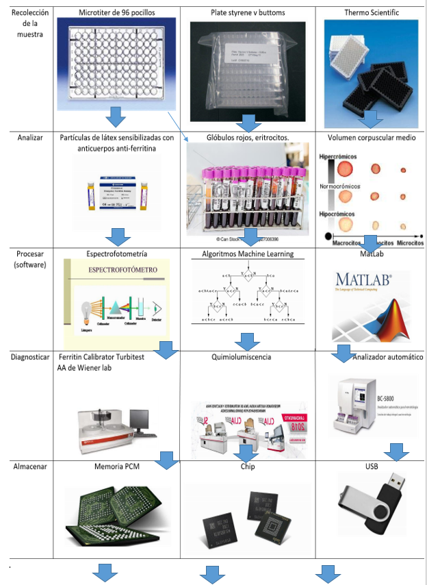
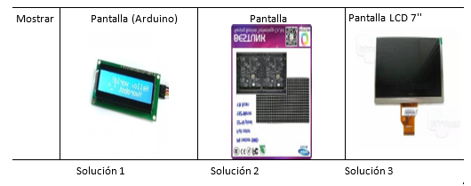
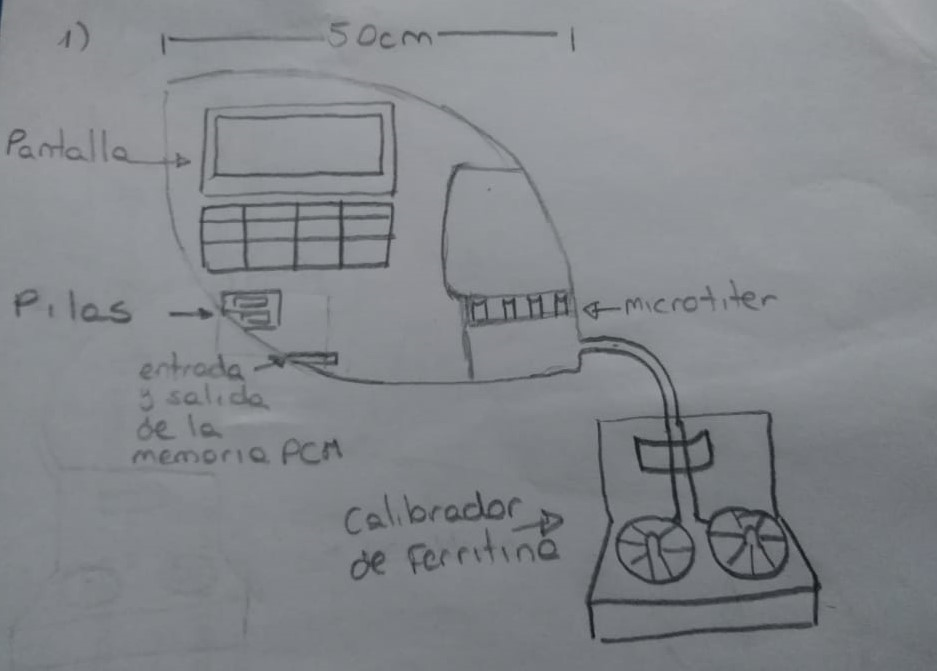
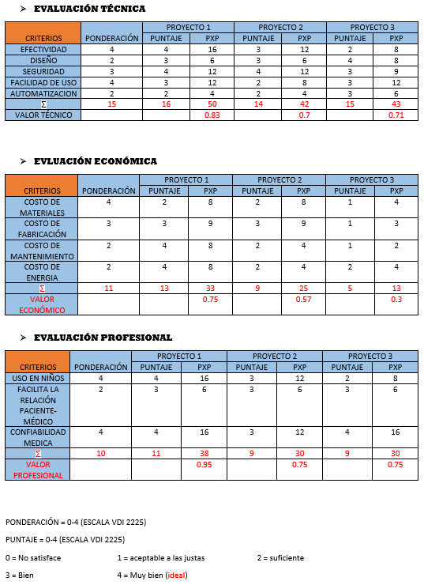
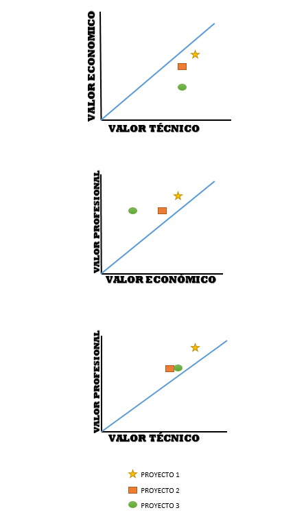

<h2> 1. TABLA DE REQUERIMIENTOS</h2>

  
 

<h2> 2. ENTRADAS Y SALIDAS </h2>

  
 

<h2>3. ESQUEMA DE FUNCIONES</h2>

  
 

<h2>4. MATRIZ MORFOLÓGICA</h2>

  
 

 

  
 

<h2>5. ELABORACIÓN DE CONCEPTOS</h2>
Se requiere un mejor diagnóstico ya que el hemograma solo analiza la cantidad y calidad de los eritrocitos y estos pueden salir bajos no solo por anemia, sino por problemas en la médula ósea, falta de vitaminas entre otras muchas enfermedades, por eso se desea hacer los análisis bioquímicos: ferritina y PCRCProteína (recreativa). La ferritina es una proteína almacenadora de hierro. El PCR mide la concentración de la proteína C, cuando se eleva significa que hay inflamación lo que provoca que el análisis de ferritina sea incorrecto. Por todo lo mencionado es necesario complementar estos tres análisis, además de realizar un seguimiento al paciente.
<h2>6. PROYECTOS PRELIMINARES</h2>

  
 

 <h2>7. MATRIZ DE EVALUACIÓN</h2>
 

  
 

  <h2>8. PROYECTO ÓPTIMO</h2>
 

  
 

