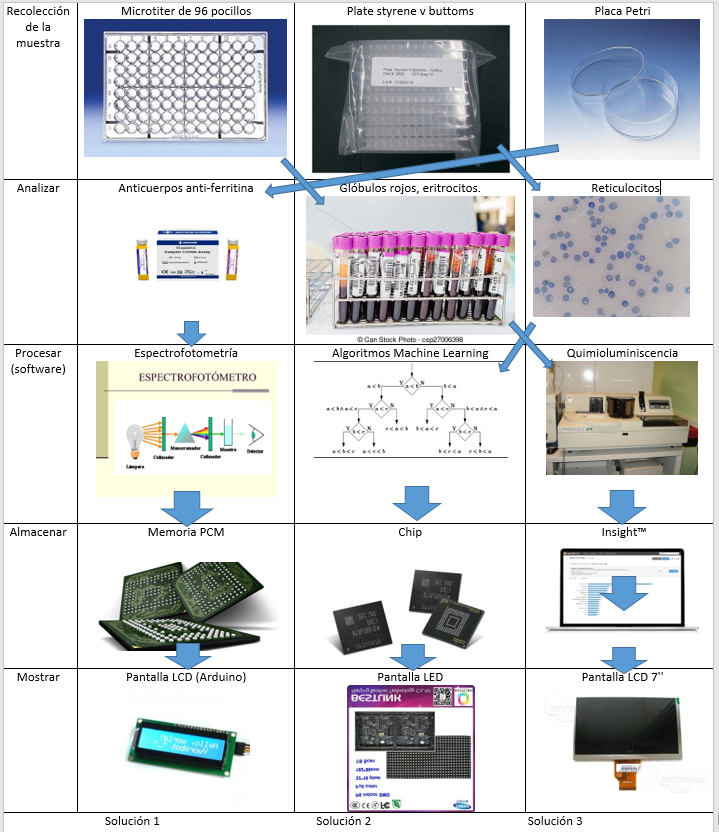

#Entregable-3
<h2> 1. TABLA DE REQUERIMIENTOS</h2>

  
 

<h2> 2. ENTRADAS Y SALIDAS </h2>
<h3>2.1. ENTRADAS</h3>

- ENERGÍA: Energía utilizada para su funcionamiento, diagnóstico eléctrico.

- MUESTRA: Elemento biológico necesario para extraer los indicadores deseados.

- REACTIVOS: Buffer hepes 100 mmol/1, PH=7, más partículas de latex recubiertas de anticuerpos de conejo anti-ferritina humana en BUFFER HEPES.

- SEÑALES: Botón de encendido y apagado y botón de diagnóstico.

<h3>2.2. SALIDAS</h3>

- SEÑALES: Mediante una pantalla evidencia la cantidad de ferritina en la muestra analizada (porcentaje) y un diagnóstico inicial de anemia ferropénica.

- INFORMACIÓN: Datos recopilados del análisis compresos en formato “.txt".

<h2>3. ESQUEMA DE FUNCIONES</h2>

<h2>4. MATRIZ MORFOLÓGICA</h2>

  
 

 

  
 

